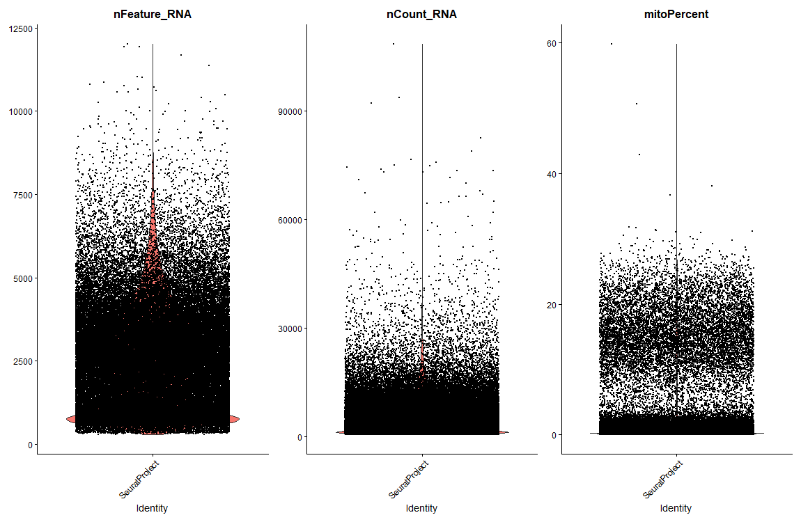
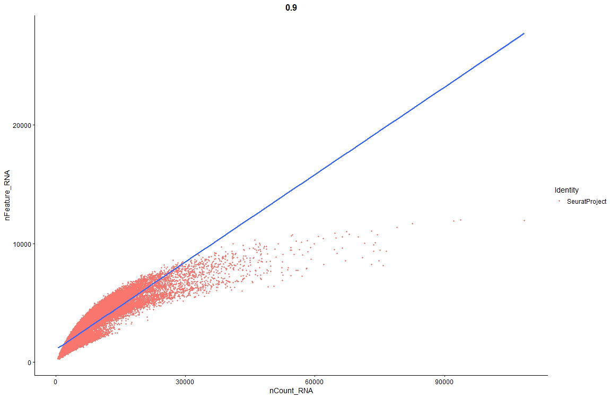
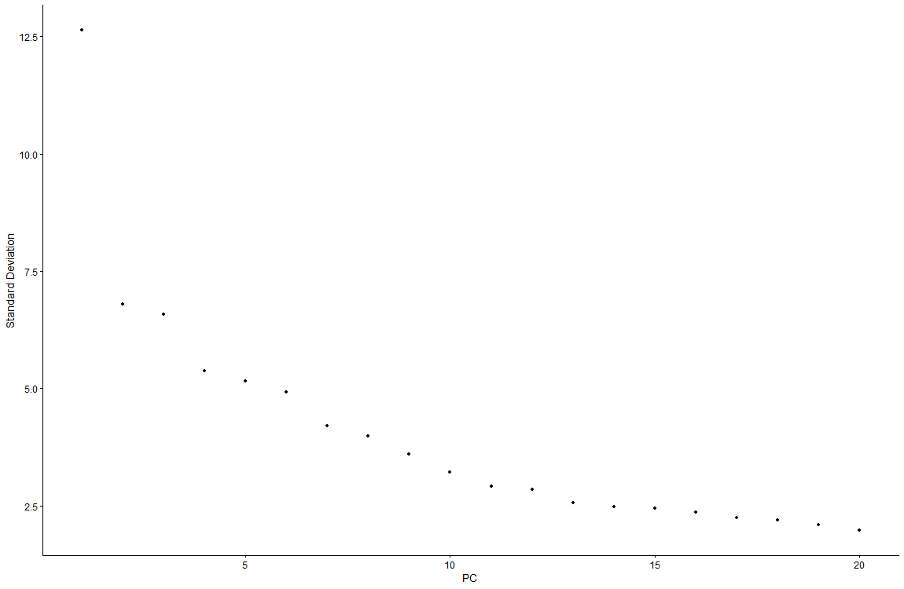
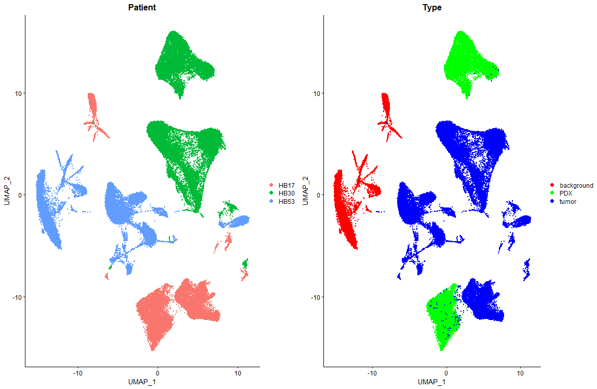
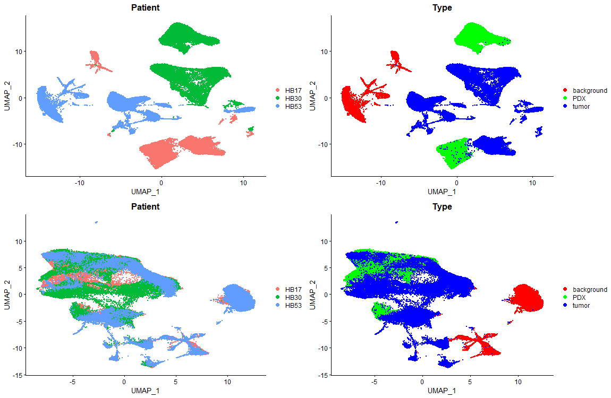

# Integration of Single Cell RNAseq Data Tutorial
Author: Jesus Zeno

# Overview:
The purpose of this tutorial is to help users integrate single cell RNAseq data across different conditions to indentify cells that are similar to each other. This workflow will start from the barcodes, genes, and matrix files and end with visualization of the clusters based on patient and tissue type.


## Table of Contents

<a href="#Documentation">Documentation</a></br>

<a href="#Setup">Setup</a></br>
<a href="#QC & Filtering">QC & Filtering</a></br>
<a href="#Explore QC">Explore QC</a></br>
<a href="#Perform Standard Workflow to Determine if Any Batch Effects Are Present">Perform Standard Workflow to Determine if Any Batch Effects Are Present</a></br>
<a href="#Perform Integration To Correct For Batch Effects">Perform Integration To Correct For Batch Effects</a></br>
</br>

## <a name="Documentation">Documentation</a>
Seurat: [Here](https://satijalab.org/seurat/articles/pbmc3k_tutorial.html#setup-the-seurat-object-1) is a link to the general scRNAseq vignette. [Here](https://satijalab.org/seurat/articles/integration_introduction.html) is the vignette specific to scRNAseq integration. 

[Video Reference](https://youtu.be/HrbeaEJqKcY) for how this was done using this dataset and what I used to learn this.

[Here](https://www.ncbi.nlm.nih.gov/geo/query/acc.cgi?acc=GSE180665) is a link to the study and dataset.

[This](https://hbctraining.github.io/scRNA-seq_online/lessons/06_integration.html) is a very good walkthrough. It goes into details for different steps and explains the logic behind some of the methods used. 

### <a name="Setup">Setup</a>
```{R eval=FALSE}
# script to integrate scRNA-Seq datasets to correct for batch effects
# setwd("~/Your/File/Path/single_cell_integrate")

# load libraries
library(Seurat)
library(ggplot2)
library(tidyverse)
library(gridExtra)

# Get data location
dirs <- list.dirs(path = 'data/', recursive = F, full.names = F)

# Automate creating variable names, creating count matrix, and seurat object
# with for loop. 
for(x in dirs){
  # Create the variable names. 
  name <- gsub('_filtered_feature_bc_matrix','', x)
  
  # Create a count matrix
  cts <- ReadMtx(mtx = paste0('data/',x,'/matrix.mtx.gz'),
                 features = paste0('data/',x,'/features.tsv.gz'),
                 cells = paste0('data/',x,'/barcodes.tsv.gz'))
  
  # Create seurat objects. This will assign the seurat object to the value of 
  # name.
  assign(name, CreateSeuratObject(counts = cts))
}


# Merge datasets so we can perform QC and filtering on all seurat objects 
# simultaneously.

# Get names of the objects we have so we can put them in a vector to be merged
ls()
# [1] "cts"             "dirs"            "HB17_background" "HB17_PDX"       
# [5] "HB17_tumor"      "HB30_PDX"        "HB30_tumor"      "HB53_background"
# [9] "HB53_tumor"      "name"            "x"

# Merge datasets. It is important to assign cell IDs so we can distinguish 
# each dataset. The add.cell.ids allows us to do that. Order matters for this.
# In this instance we can just use [3:9] to grab the cell IDs. Project name
# is HB since it is a Hepatoblastoma dataset. 
merged_seurat <- merge(HB17_background, y = c(HB17_PDX, HB17_tumor, HB30_PDX, 
                                              HB30_tumor, HB53_background,
                                              HB53_tumor),
                       add.cell.ids = ls()[3:9],
                       project = 'HB')

# Check merged object
merged_seurat
# An object of class Seurat 
# 33538 features across 77936 samples within 1 assay 
# Active assay: RNA (33538 features, 0 variable features)
```

### <a name="QC & Filtering">QC & Filtering</a>
```{R eval=FALSE}
# Look at our metadata first
View(merged_seurat@meta.data)
# Cell barcodes are prefixed with the patient ID and tissue type. We want to 
# make another column to tell us which patient and tissue the barcode has 
# originated from. 

# Create a sample column
merged_seurat$sample <- rownames(merged_seurat@meta.data)
View(merged_seurat@meta.data) # Sanity check

# Split sample column so we can have the patient, type, and barcode in their 
# own columns. 
merged_seurat@meta.data <- separate(merged_seurat@meta.data, col = 'sample', 
                                    into = c('Patient', 'Type', 'Barcode'), 
                                    sep = '_')
View(merged_seurat@meta.data) # Sanity check and see what data looks like.

# Further checking to ensure that our merged object contains data from all 
# three patients and the tissue types. 
unique(merged_seurat@meta.data$Patient)
# [1] "HB17" "HB30" "HB53"

unique(merged_seurat@meta.data$Type)
# [1] "background" "PDX"        "tumor"


# Calculate mitochondrial percentage to filter our low quality cells
merged_seurat$mitoPercent <- PercentageFeatureSet(merged_seurat, pattern='^MT-')


# We can look at additional metrics assess the quality of data. We can look at 
# number of cells in our samples, transcript counts, gene counts, and correlate
# them with each other. We can also see which cells have a high number of 
# transcript counts and a high number of genes. 
```

### <a name="Explore QC">Explore QC</a>
```{R eval=FALSE}
# Visualize the features and save file
png("QC_metrics_as_Violin_plot.png", width = 1150, height = 750)
VlnPlot(merged_seurat, features = c("nFeature_RNA", "nCount_RNA", 
                                       "mitoPercent"), ncol = 3)
dev.off()
# Based on plots, we can see that there is a large amount of cells that have a 
# different number of genes spread across a spectrum. We also have a lot of 
# cells with a higher number of molecules detected as well as a decent 
# percentage of mitochondrial DNA. Most of the mitochondrial DNA is less than 
# 30% and that is likely due to taking the filtered files. We want to filter 
# out these cells for downstream processing.
```


```{R eval=FALSE}
# Let's look at another metric so we can have a second point of reference to 
# determine what to filter. Good quality cells should have a good number of 
# genes and molecules detected. 
png("QC_metrics_as_Feature_Scatter_plot.png", width = 1150, height = 750)
FeatureScatter(merged_seurat, feature1 = "nCount_RNA", 
               feature2 = "nFeature_RNA") + geom_smooth(method = 'lm')
dev.off()
# A majority of cells seem to follow the straight line which is good. We don't 
# want to see any cells in the lower right corner, which would indicate that 
# the experiment has only captured a few genes and those genes are being 
# transcribed repeatedly. We also don't want to see any cells in the top left 
# corner, which would indicate the experiment captured a high number of genes
# but they aren't deeply sequenced enough. 
```


```{R eval=FALSE}
# Filtering. Using the thresholds that authors used in the paper. 
merged_seurat_filtered <- subset(merged_seurat, subset = nCount_RNA > 800 &
                                   nFeature_RNA > 500 &
                                   mitoPercent < 10)

# Let's check how many features and cells we had before and after filtering.
# Before:
merged_seurat
# An object of class Seurat 
# 33538 features across 77936 samples within 1 assay 
# Active assay: RNA (33538 features, 0 variable features)

# After:
merged_seurat_filtered
# An object of class Seurat 
# 33538 features across 67851 samples within 1 assay 
# Active assay: RNA (33538 features, 0 variable features)

# This comes out to about the same amount of features(genes) with about 10k 
# samples less than before filtering. 
```


### <a name="Perform Standard Workflow to Determine if Any Batch Effects Are Present">Perform Standard Workflow to Determine if Any Batch Effects Are Present</a>
```{R eval=FALSE}
# This will help us determine if integration is necessary for this data. We 
# explore and visualize our data in low dimensional space. 
# For more details on this process, refer to the differential gene expression 
# page. 
merged_seurat_filtered <- NormalizeData(object = merged_seurat_filtered)
merged_seurat_filtered <- FindVariableFeatures(object = merged_seurat_filtered)
merged_seurat_filtered <- ScaleData(object = merged_seurat_filtered)
merged_seurat_filtered <- RunPCA(object = merged_seurat_filtered)
png("Elbow_plot.png", width = 1150, height = 750)
ElbowPlot(merged_seurat_filtered)
dev.off()
```


```{R eval=FALSE}
# First 15 PCs seems to capture a majority of the variation. We will consider
# all 20 PCs in the next steps to be safe. 
merged_seurat_filtered <- FindNeighbors(object = merged_seurat_filtered, 
                                        dims = 1:20)
merged_seurat_filtered <- FindClusters(object = merged_seurat_filtered)
merged_seurat_filtered <- RunUMAP(object = merged_seurat_filtered, dims = 1:20)


# Visualize data in low dimensional space. 
# Plot to color cells by patient and tissue type. 
p1 <- DimPlot(merged_seurat_filtered, reduction = 'umap', group.by = 'Patient')
p2 <- DimPlot(merged_seurat_filtered, reduction = 'umap', group.by = 'Type',
              cols = c('red','green','blue'))

png("Dim_Plots_by_Patient_and_Type.png", width = 1150, height = 750)
grid.arrange(p1, p2, ncol = 2, nrow = 1)
dev.off()
```


```{R eval=FALSE}
# The plot on the right gives a misleading image. We see sub-populations of 
# cells within our tissue type. From the plot on the left we can identify that
# the clustering we see is due to the technical variation and not biological
# variation among the cells. We can see that the cells coming from different 
# patients cluster separately and it is masking the biological variation. 
# Therefore, we need to adjust for the batch effects here to allow the cells 
# to cluster according to biological variation. 

# Save integrated seurat (pre-batch correction) object as an RDS object so we 
# don't have to do all the steps again and we can easily call this again later
# if needed.
saveRDS(merged_seurat_filtered, file = 'C:\\Your\\File\\Path\\GSE180665\\GSE180665_non_batch_corrected_seurat.rds')

# If we need to read the rds file back in to pick up where we left off, use this
merged_seurat_filtered <- readRDS(file = 'C:\\Your\\File\\Path\\GSE180665\\GSE180665_non_batch_corrected_seurat.rds')
```

### <a name="Perform Integration To Correct For Batch Effects">Perform Integration To Correct For Batch Effects</a>
```{R eval=FALSE}
# Split the object by the patient since we see batch effects coming from 
# different patients.
# If you are getting errors about allocating vector size, increase the memory
# limit before making the object list. 
memory.limit(size = 20000)
obj.list <- SplitObject(merged_seurat_filtered, split.by = 'Patient')
# $HB17
# An object of class Seurat 
# 33538 features across 17706 samples within 1 assay 
# Active assay: RNA (33538 features, 2000 variable features)
# 2 dimensional reductions calculated: pca, umap
# 
# $HB30
# An object of class Seurat 
# 33538 features across 28813 samples within 1 assay 
# Active assay: RNA (33538 features, 2000 variable features)
# 2 dimensional reductions calculated: pca, umap
# 
# $HB53
# An object of class Seurat 
# 33538 features across 21332 samples within 1 assay 
# Active assay: RNA (33538 features, 2000 variable features)
# 2 dimensional reductions calculated: pca, umap

# For each object in the list, we need to run normalization and identify 
# highly variable features. 
memory.limit(size = 25000)
for(i in 1:length(obj.list)){
  obj.list[[i]] <- NormalizeData(object = obj.list[[i]])
  obj.list[[i]] <- FindVariableFeatures(object = obj.list[[i]])
}


# Select integration features
features <- SelectIntegrationFeatures(object.list = obj.list)

# Find integration anchors using canonical correlation analysis (CCA)
memory.limit(size = 30000)
# Note: when finding all pairwise anchors, it will stay at 0%. However, the
# calculations are still being run and jump to 100% when completed. It 
# could take up to 15 minutes to run with this dataset. For my machine, it took
# about 90 minutes. 
anchors <- FindIntegrationAnchors(object.list = obj.list,
                                  anchor.features = features)
# Merging objects
# Finding neighborhoods
# Finding anchors
# Found 39186 anchors
# Filtering anchors
# Retained 5576 anchors

# Merging objects
# Finding neighborhoods
# Finding anchors
# Found 29649 anchors
# Filtering anchors
# Retained 3729 anchors

# Merging objects
# Finding neighborhoods
# Finding anchors
# Found 38359 anchors
# Filtering anchors
# Retained 4464 anchors

# Integrate data
memory.limit(size = 38000)
# This step will take quite a long time. It took my machine about an hour or 
# two. 
seurat.integrated <- IntegrateData(anchorset = anchors)


# Scale data, run PCA and UMAP and visualize integrated data
seurat.integrated <- ScaleData(object = seurat.integrated)
seurat.integrated <- RunPCA(object = seurat.integrated)

# Arbitrarily choosing 50 dimensions. 
seurat.integrated <- RunUMAP(object = seurat.integrated, dims = 1:50)


p3 <- DimPlot(seurat.integrated, reduction = 'umap', group.by = 'Patient')
p4 <- DimPlot(seurat.integrated, reduction = 'umap', group.by = 'Type',
              cols = c('red','green','blue'))

png("Dim_Plots_Integrated_by_Patient_and_Type_compare_batch_vs_non_batch.png",
    width = 1150, height = 750)
grid.arrange(p1, p2, p3, p4, ncol = 2, nrow = 2)
dev.off()
```


```{R eval=FALSE}
# Based on the plots we can see that the cells aren't separating out because 
# they are from different patients. They are seperting due to biological 
# similarities. Cells from PDX and tumor overlap in a lot of places and are 
# separated out from the cells coming from the background. From integration 
# and correction of batch effects, we can see within group variation and 
# out of group variation. 

# Save integrated (batch corrected) seurat object as an RDS object so we don't 
# have to do all the steps again and we can easily call this again later if 
# needed.
saveRDS(seurat.integrated, file = 'C:\\Your\\File\\Path\\GSE180665\\GSE180665_batch_corrected_seurat.rds')

# If we need to read the rds file back in to pick up where we left off, use this
seurat.integrated <- readRDS(file = 'C:\\Your\\File\\Path\\GSE180665\\GSE180665_batch_corrected_seurat.rds')
```